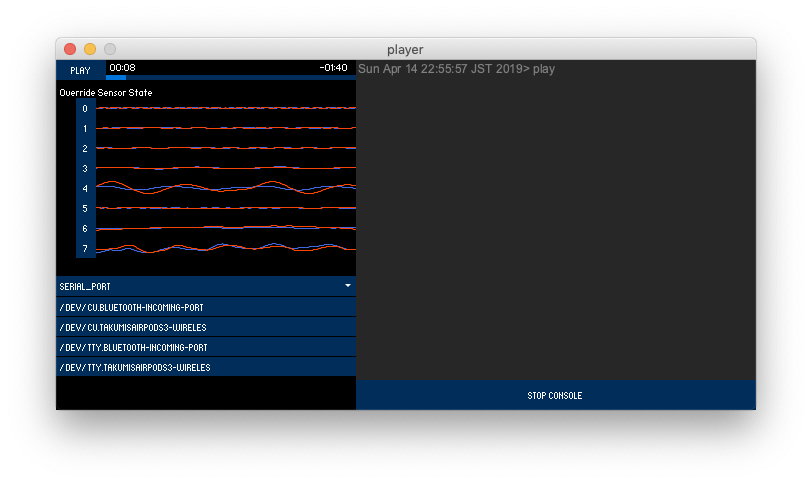

# Singing Cobweb  唄う蜘蛛の巣

## Dependencies
- [controlP5](http://www.sojamo.de/libraries/controlP5/)
- [minim](http://code.compartmental.net/minim/)

メニューバーの`Sketch > ImportLibrary > addLibrary`からインストールする。

## コンセプト文

蜘蛛の巣を模したドイリーに触れることで音を奏でることができる参加型インスタレーション。ウール１００％の毛糸で編まれたレース状の本作品は、手仕事で温かみのある風合いでありつつも蜘蛛の巣のような形状であることで捕食される不気味さが漂う。
毛糸の一部に導電性繊維が縫い込まれており、毛糸に触れるだけで信号を感知しスピーカーからオーケストラの楽器が鳴る仕組みとなっている。導電性繊維（通称導電糸）は非常に細く毛糸繊維に溶け込んでいるため目視では導電糸を探ることはできない。導電糸は本作品に合計８箇所縫い込まれており、それぞれが違う楽器を鳴らすよう指示されている。8箇所の導電糸を同時に触れるとオーケストラの合奏を聴くことができる。しかし接触箇所は点在しており、縫い込まれている場所も目視できないため同時に触れる事が難しく、美しい合奏を聴きたい場合は複数人と協力したり、身体を伸ばして全箇所に触れようと奮闘しなくてはならない。この様子が、蜘蛛の巣に捕まって必死にもがく人のように見える。

本作品は、この仕掛けに夢中になることで蜘蛛の巣に補食されている人（鑑賞者）を「テクノロジーに補食された人」として揶揄している。私たちが生み出してきたテクノロジーは人々の暮らしを豊かにしていく一方で、そのテクノロジーに支配される事がしばしばあるが、人々は時としてその事実に無関心である。単純なゲームをクリアさせるために奮闘する鑑賞者を別の鑑賞者が俯瞰的に観る事で、可視化されづらいテクノロジーの弊害を抽象的に指摘している。本作品を嘲笑することでテクノロジーを扱う事の難しさや、今後ますます発展していく科学技術をより有意義に利用するためのコンピューター・リテラシー向上について問いかける作品となっている。

## 展示内容
横幅最小２m〜８mに及ぶ蜘蛛の巣のようなオブジェを展示。鑑賞者が毛糸に触れると音が鳴るインタラクティブアートとなっており、沢山のひとが参加されれば捕食されている人々として俯瞰的にも作品を楽しめます。
詳しくは動画資料を参照ください。

URL:   https://youtu.be/sxSDEZ2X-sc
